# RE5 Save Editor 360+PC

Editor de save do **Resident Evil 5** para **Xbox 360** e **PC (Steam)** num
programa só, em português. Feito em Rust com interface em [Slint](https://slint.dev),
para Linux e Windows, sem HTML e sem depender de navegador ou WebView.

É o irmão do [re5-save-editor-360](https://github.com/lux-insider/re5-save-editor-360),
só que também abre saves de PC e edita os desbloqueios.

## Novidades da 1.2.0

- **Ícones originais do jogo** em todo o editor: slots do Chris e da Sheva,
  inventário (agora uma grade de ícones, como o baú do jogo) e escolha do item
  pelo ícone. São 174 ícones, tirados das texturas do próprio RE5 e das DLCs.
- **Ficha do item** no painel de edição: nome oficial, ID, descrição do jogo e
  marca de DLC.
- **Aba Itens Extras**: os registros da tabela de itens do jogo que não vão
  para o save (armas de inimigos, objetos de fase, armas sem nome das DLCs,
  coletáveis ainda não testados e registros internos), com ficha de cada um.
  Só para consulta.
- **Aba História**: os 12 arquivos da Biblioteca, os 26 documentos das fases e
  os 9 documentos das DLCs, **traduzidos para o português**, com leitor.
  Mostra quais arquivos estão desbloqueados no save aberto.
- **Nomes e descrições em português**, com o nome oficial em inglês entre
  parênteses (tradução própria do projeto).
- Itens das DLCs (Lost in Nightmares e Desperate Escape) ficam só em Itens
  Extras: só existem com a DLC carregada e não têm uso na campanha.
- Interface com a fonte Tahoma (padrão no Windows; no Linux, instale a Tahoma
  para ter o mesmo visual).
- **Catálogo dos 407 registros** de item (`dados/re5_itens_db.json`), montado
  a partir da tabela interna do jogo (ITEM_INFO_STRUCT) e dos textos do jogo e
  das DLCs. Os itens das DLCs Lost in Nightmares e Desperate Escape aparecem
  marcados.
- Nos slots do Chris e da Sheva, a lista oferece só o que o jogo aceita no
  slot do personagem (armas, munição, cura e coletes). O inventário continua
  com tudo. Um item que já esteja no save nunca some da lista.
- Nada novo passou a ser gravado: os itens graváveis são os mesmos da versão
  anterior (testados no console).

## Novidades da 1.1

- **Saves de PC (Steam)**, além do Xbox 360. Ao abrir, o editor descobre sozinho
  de qual plataforma é o save.
- **Desbloqueios no Xbox 360**: roupas do Chris e da Sheva, filtros de tela,
  munição infinita (19 armas), Arquivos da Biblioteca (12) e Figuras (45).
  No Xbox eles ficam 0xB4 bytes antes dos do PC (dinheiro em 0xE0 no Xbox e
  0x194 no PC). Conferido num save real: 0x7C tem exatamente 19 bits ligados
  (as 19 armas) e 0x80 tem 12 (os 12 arquivos). Só os bits de cada lista são
  alterados; bits desconhecidos ficam como estavam.
- **Data do save** editável, nas duas plataformas.
- **Interface nativa em Slint**: abas (Save, Desbloqueios, Personagens,
  Inventário), menus, tabela do inventário, seleção do Chris ou da Sheva pelo
  retrato e painel de edição do slot. Não usa HTML, CSS, JavaScript nem WebView:
  no Windows não precisa do WebView2.
- **Arrastar e soltar** o save na janela, e **Salvar como…**.
- No estilo do editor de PC do shinneider: wallpaper, cartão translúcido,
  campos e botões no estilo Material.

Continua tudo do editor do Xbox: Gold e Exchange Points, os 9 slots do Chris e
da Sheva, os 84 espaços do inventário (com os tesouros pelo nome), perfil
(XUID) e device ID copiados de outro save, assinatura automática com o keyvault
do console e backup antes de cada gravação.

## Screenshots

Telas da versão 1.2.0 com um save real do Xbox 360. Na primeira, o perfil
(XUID), o device ID, o console da assinatura e o caminho do arquivo foram
borrados.

### Save
Dinheiro, data do save, checksum, assinatura e os IDs de perfil e console.

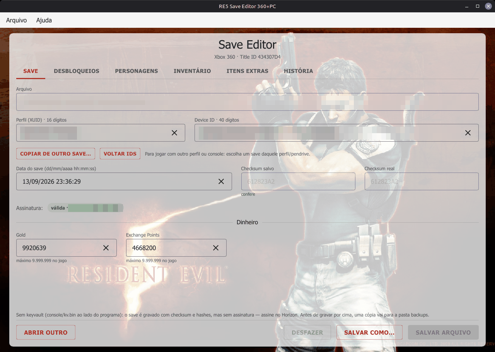

### Chris e Sheva
Os 9 slots de cada personagem com os ícones originais do jogo. Ao escolher um
slot, o painel mostra a ficha do item e a grade para trocar pelo ícone.

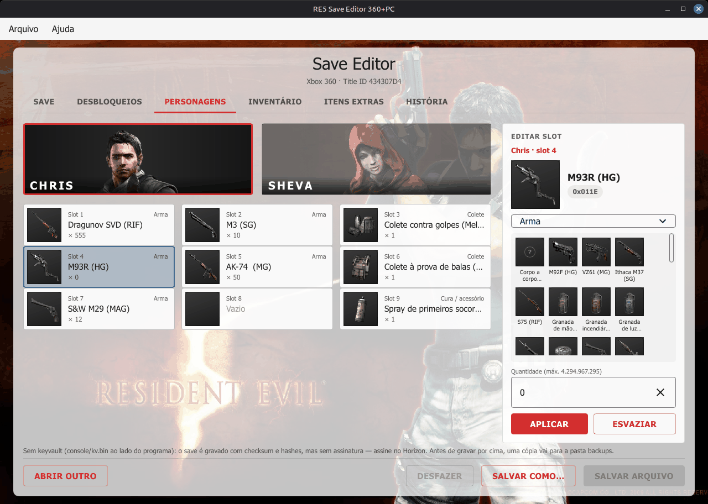

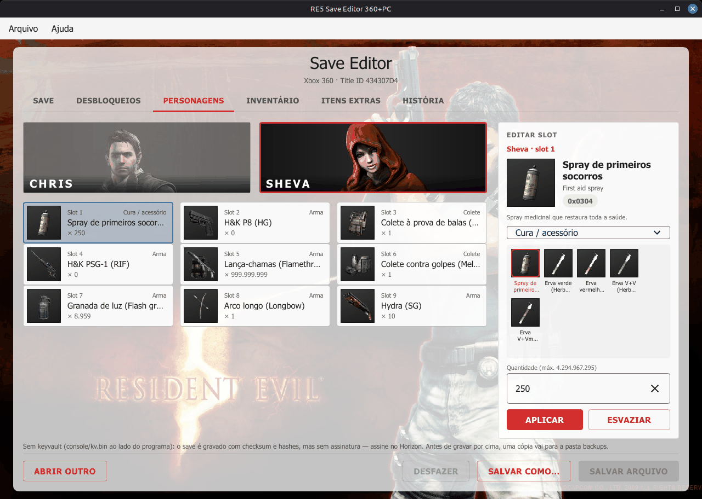

### Inventário
Os 84 espaços numa grade de ícones, como o baú do jogo, com quantidade e nome.
No painel, a grade de itens da classe escolhida (aqui, os tesouros).

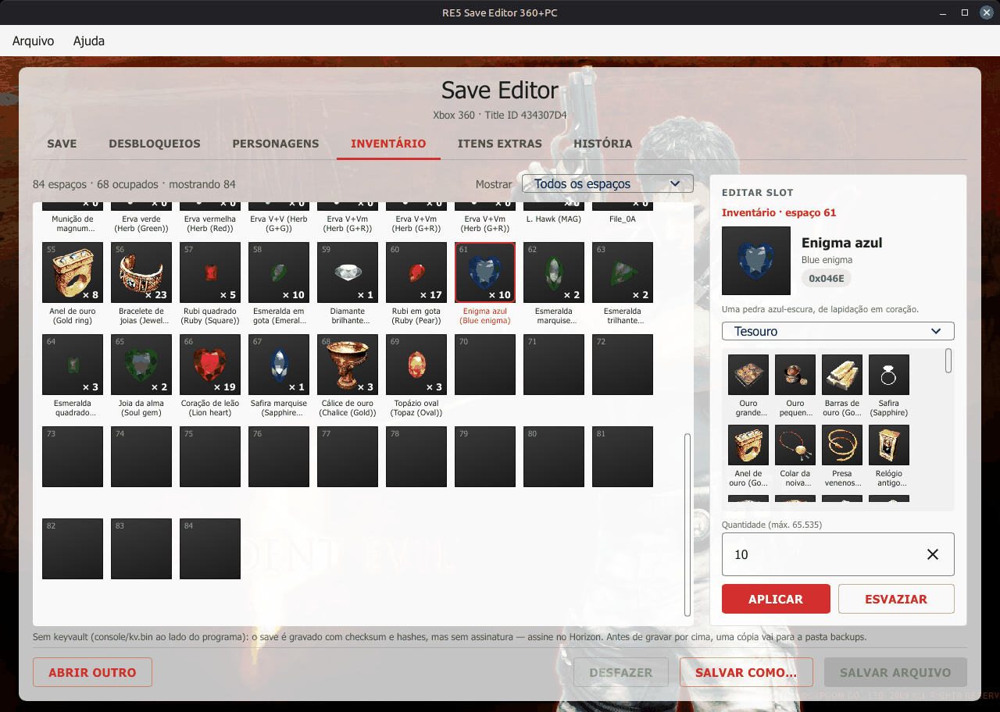

### Itens Extras
Registros da tabela de itens do jogo que não vão para o save, só para
consulta: itens das DLCs, armas de inimigos, objetos de fase e outros. Os
itens sem imagem no jogo aparecem com "?".

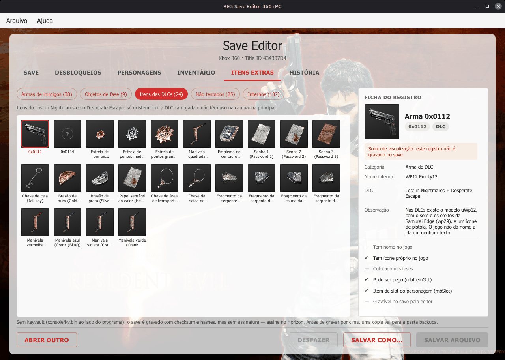

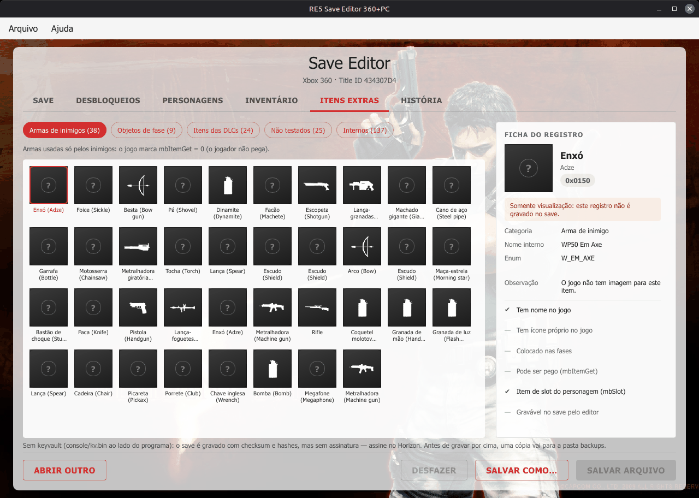

### Desbloqueios
Roupas do Chris e da Sheva, filtros de tela, munição infinita, arquivos da
Biblioteca e figuras.

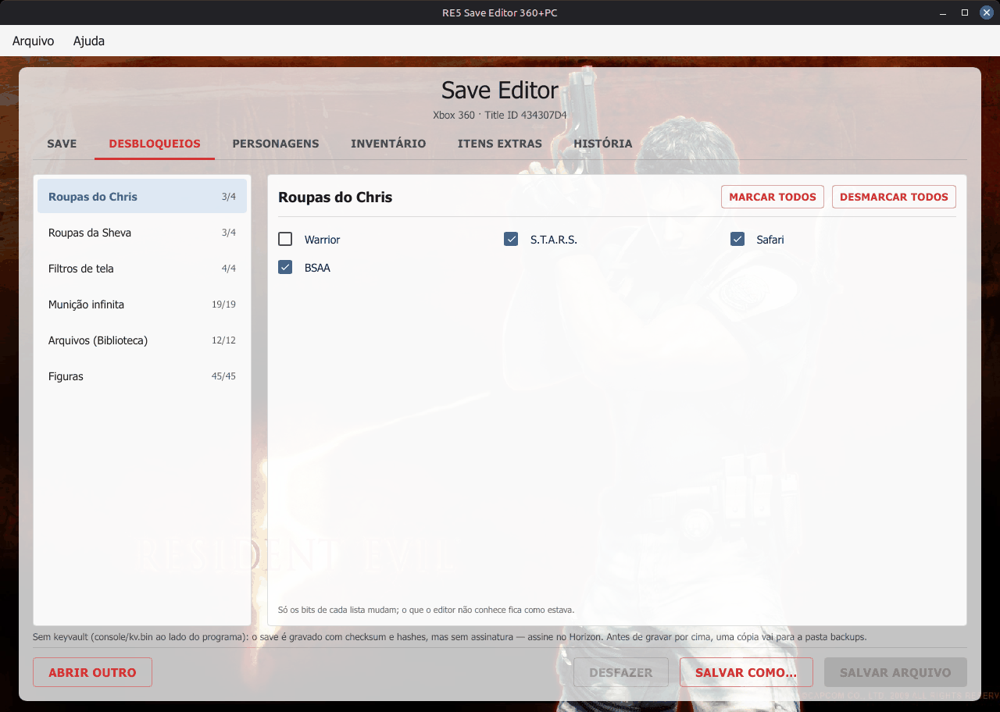

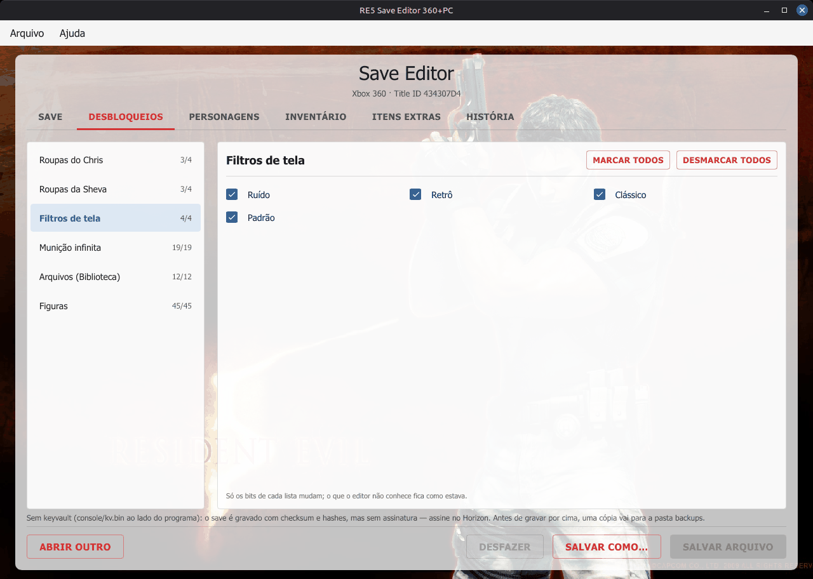

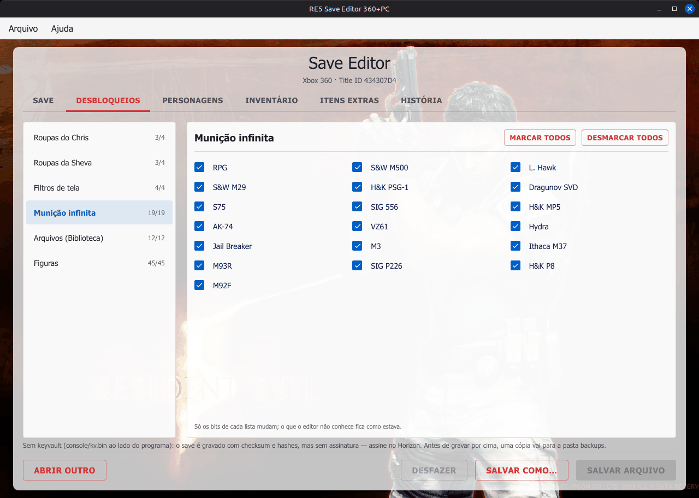

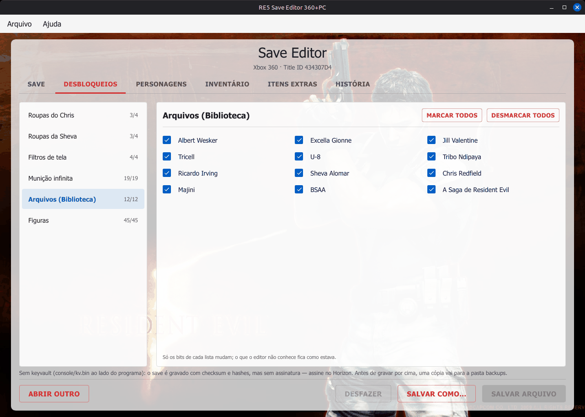

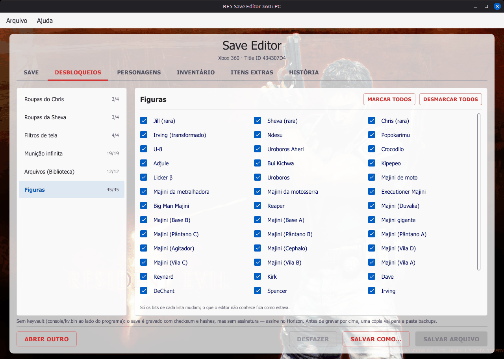

### História
Os arquivos da Biblioteca e os documentos do jogo e das DLCs, em português,
com a marca de desbloqueado no save aberto.

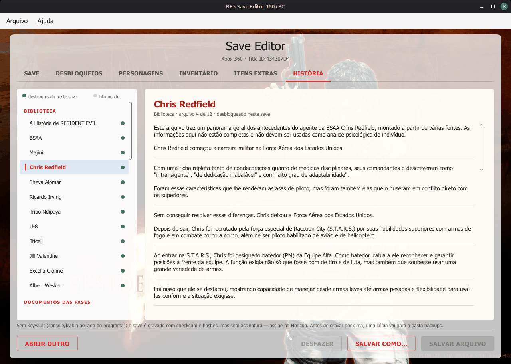

## O que edita

| | Xbox 360 | PC |
|---|:---:|:---:|
| Gold / Money e Exchange Points | ✓ | ✓ |
| Data do save | ✓ | ✓ |
| Roupas, filtros, munição infinita, arquivos, figuras | ✓ | ✓ |
| Slots do Chris e da Sheva, inventário (84 espaços) | ✓ | — |
| Perfil (XUID) e device ID | ✓ | — |
| Steam ID | — | ✓ |
| Assinatura com o keyvault do console | ✓ | — |

## Usar

Baixe na página de **Releases** e descompacte:

```
RE5-Save-Editor-360-PC           Linux (~12 MB)
RE5 Save Editor 360+PC.exe       Windows 10/11 (~10 MB)
console/kv.bin                   keyvault do seu console (opcional, para assinar)
backups/                         cópia do save antes de cada gravação
```

Abra o programa, clique em **Escolher arquivo** (ou arraste o save para a
janela), edite e clique em **Salvar arquivo**.

- Xbox 360: o `savedata.bin` do pendrive, em `Content\<perfil>\434307D4\00000001\`.
- PC: `Steam\userdata\<id>\21690\remote\savedata.bin`.

Sem o `kv.bin` o save do Xbox é gravado com checksum e hashes corretos, mas
sem assinatura. O `kv.bin` é a identidade do seu console: **não compartilhe**.

## Compilar

```bash
cargo build --release                                            # Linux
cargo xwin build --release --target x86_64-pc-windows-msvc       # Windows
cargo test --release
```

No Linux precisa de `libgtk-3-dev` (diálogos de arquivo) e `libfontconfig-dev`.

**Versão pessoal com a chave embutida** (só para uso próprio): compile com a
opção `kv-embutido` e o caminho do seu `kv.bin`. O programa assina o save do
Xbox sem precisar da pasta `console`:

```bash
RE5_KV_EMBUTIDO=/caminho/do/kv.bin cargo build --release --features kv-embutido --target-dir target-pessoal
```

O `kv.bin` não entra no repositório, mas **o executável gerado passa a conter a
chave do seu console**: não compartilhe nem publique esse executável.
`examples/verifica.rs` lê e edita saves pela linha de comando, para testes.

## Estrutura

```
src/save.rs          backend: lê e grava o save (Xbox 360 e PC)
src/sistema/         pastas, keyvault e diálogos de arquivo
src/interface/       controlador: o único ponto entre a interface e o backend
src/itens.rs         catálogo dos 407 registros de item (src/dados/itens.json)
src/historia.rs      textos da Biblioteca e documentos (src/dados/historia.json)
dados/               banco completo dos 407 registros (re5_itens_db.json)
ui/ponte.slint       tudo que a interface lê e os callbacks que ela chama
ui/app.slint         janela, menus e abas
ui/telas/            início, save, desbloqueios, personagens, inventário,
                     itens extras, história
ui/componentes/      botões, campos, slots, ícones, diálogos
ui/imagens/icones.png  os 174 ícones originais num atlas
```

Detalhes da migração e o checklist das funções em [docs/MIGRACAO-SLINT.md](docs/MIGRACAO-SLINT.md).

## Como foi conferido

- **Xbox 360**: sem mudanças, e com as mesmas edições, o arquivo gerado é
  idêntico byte a byte ao do re5-save-editor-360, que já foi testado no console.
  Nos desbloqueios mudam só os bytes esperados, e checksum, hashes e assinatura
  são validados pelo código antigo.
- **PC**: conferido contra o código original do shinneider. O editor lê os
  mesmos valores, e o arquivo gravado por ele passa no checksum do original.
  O teste usou um save gerado pelo código dele, não um save real de PC.

## Créditos

Formato do save de PC, endereços e listas dos desbloqueios do PC, estilo da
tela e wallpaper: [RE5 Save Editor de shinneider](https://github.com/shinneider/RE5-Save-Editor)
(MIT). Detalhes em [CREDITOS.txt](CREDITOS.txt).

Projeto de fã, sem ligação com a Capcom ou a Microsoft. *Resident Evil*, as
imagens, os ícones e os textos do jogo pertencem à Capcom. Faça backup do save antes de editar; use
por sua conta e risco.

## Licença

MIT — veja [LICENSE](LICENSE).

A interface usa o [Slint](https://slint.dev) sob a Slint Royalty-free License
(o "Sobre" do programa mostra o selo *Made with Slint*, como a licença pede).

[](https://slint.dev)
